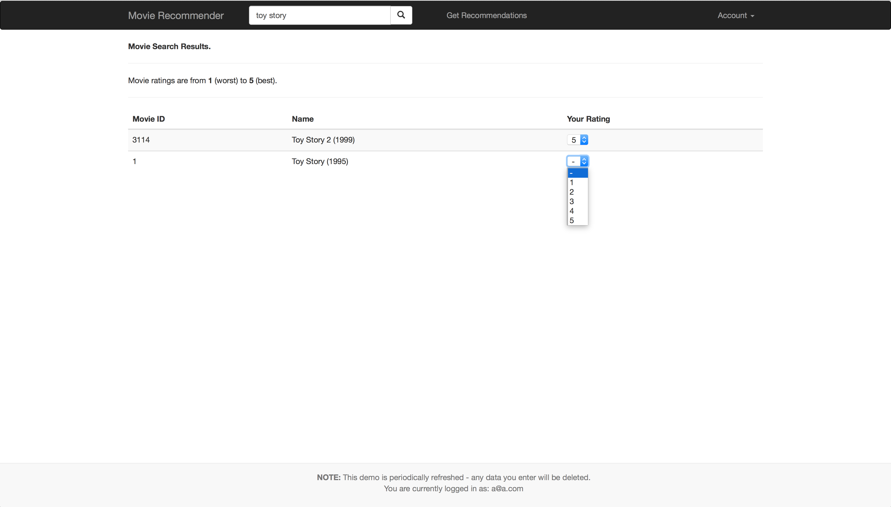
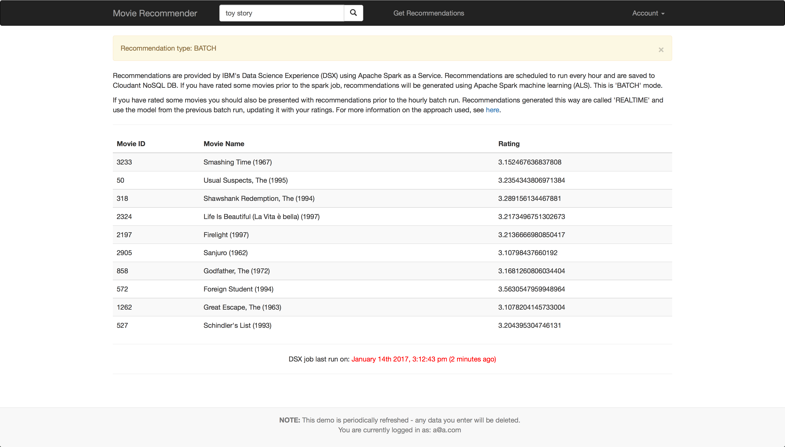

## Overview

This project walks through how you can create recommendations using Apache Spark machine learning.  There are a number of jupyter notebooks that you can run on IBM Data Science Experience, and there a live demo of a movie recommendation web application you can interact with.

**Update:** Substantial new functionality has been added to this demo.  The changes are available on a [branch](https://github.com/snowch/movie-recommender-demo/tree/messagehub_integration) and will get merged back into master shortly.

## Quick start

If you want to try out a live demo of the web application, visit [here](https://movie-recommend-demo.mybluemix.net/).  This is also an overview video on [YouTube](https://www.youtube.com/watch?v=is9ZzgbGSdM).

This project is a demo movie recommender application. This demo has been installed with approximately four thousand movies and 500,000 ratings. The ratings have been generated randomly. The purpose of this web application is to allow users to search for movies, rate movies, and receive recommendations for movies based on their ratings.

## Notebooks

Start with [Introduction](./notebooks/Introduction.ipynb) to read more about this project.

You can import these notebooks into IBM Data Science Experience.  I  have occasionally experienced issues when trying to load from a URL.  If that happens to you, try cloning or downloading this repo and importing the notebooks as files.

## Technologies

The technologies used in this demo are:

 - Python flask application
 - IBM Bluemix for hosting the web application and services
 - IBM Cloudant NoSQL for storing movies, ratings, user accounts and recommendations
 - IBM Compose Redis for maintaining an Atomic Increment counter for ID fields for user accounts (this is now optional as Cloudant UUIDs can be used)
 - IBM Datascience Experience (DSX) and Spark as a Service for:
    - exploring data and analysing ratings
    - training and testing a recommendation model
    - retraining recommendation model hourly
    - generating recommendations and saving to Cloudant
 - IBM Datascience Experience (DSX) Github integration for saving notebooks
 
The overall architecture looks like this:

## Web application screenshots 

### Rating a movie

The screenshot below shows some movies being rated by a user.

### Movie recommendations

The screenshot below shows movie recommendations provided by Spark machine learning.

## Setting up your own demo web application instance on Bluemix

### Quick deploy

Click on this link, then follow the instructions.  Note that this step may take quite a long time (maybe 30 minutes).

 - **CAUTION:** a python flask application instance with 128MB memory and an instance of Cloudant 'Lite' - you may get charged for these services.  Please check charges before deploying.  Note that Redis does not get deployed by default.

An instance of Cloudant and the Flask web application will be set up for you.

After deploying to Bluemix, you will need to create a new [DSX](http://datascience.ibm.com) project and import the notebooks.  The notebook [Step 07](./notebooks/Step%2007%20-%20Cloudant%20Datastore%20Recommender.ipynb) is responsible for creating recommendations and saving them to Cloudant.  You will not get recommendations until you have setup this notebook with your Cloudant credentials and run the notebook from DSX.

### Deploy using cf tools

See the instructions [here](https://github.com/snowch/movie-recommender-demo/blob/master/web_app/README.md)
